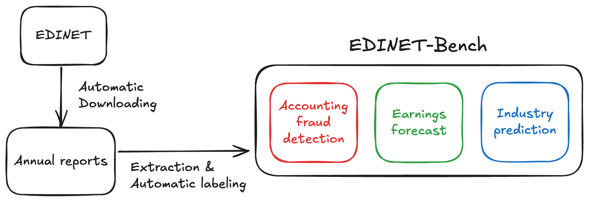

# EDINET-Bench
📚 [Paper](https://pub.sakana.ai/edinet-bench) | 📝 [Blog](https://sakana.ai/edinet-bench/) | 📁 [Dataset](https://huggingface.co/datasets/SakanaAI/EDINET-Bench)

This code can be used to evaluate LLMs on [EDINET-Bench](https://huggingface.co/datasets/SakanaAI/EDINET-Bench), a Japanese financial benchmark designed to evaluate the performance of LLMs on challenging financial tasks including accounting fraud detection, earnings forecasting, and industry prediction.
This dataset is built leveraging [EDINET](https://disclosure2.edinet-fsa.go.jp), a platform managed by the Financial Services Agency (FSA) of Japan that provides access to disclosure documents such as securities reports.


<figure>
  
  <figcaption> Overview of EDINET-Bench. </figcaption>
</figure>

For the dataset construction code, please visit https://github.com/SakanaAI/edinet2dataset.

## Install
Install the dependencies using uv.
```
uv sync
```

You also need to configure the API keys for each LLM provider in the .env file.

## Evaluation

### Accounting Fraud Detection and Earnings Forecast

Use Claude 3.5 Sonnet to predict whether a report is fraudulent based on the Balance Sheet (BS), Cash Flow (CF), Profit and Loss (PL), and summary items from annual reports.
```bash
$ python src/edinet_bench/predict.py --task fraud_detection --model claude-3-5-sonnet-20241022 --sheets bs cf pl summary
```


Use logistic model as a baseline.
```bash
$ python src/edinet_bench/logistic.py --task earnings_forecast
```

Create a leaderboard for each model.
```bash
$ python src/edinet_bench/make_leaderboard.py --task fraud_detection
```

### Industry Prediction
Predict a company's industry type (e.g., Banking) based on its current annual report.
```bash
$ python src/edinet_bench/industry_prediction/predict.py --model claude-3-5-sonnet-20241022 --sheets bs cf pl summary
```

Create a leaderboard for each model.
```
$ python src/edinet_bench/industry_prediction/make_leaderboard.py 
```


## Citation
```
@misc{sugiura2025edinet,
  author    = {Issa Sugiura and Takashi Ishida and Taro Makino and Chieko Tazuke and Takanori Nakagawa and Kosuke Nakago and David Ha},
  title     = {{EDINET-Bench: Evaluating LLMs on Complex Financial Tasks using Japanese Financial Statements}},
  institution = {Sakana AI},
  year      = {2025},
  month     = {June},
  url = {https://pub.sakana.ai/edinet-bench}
}
```
